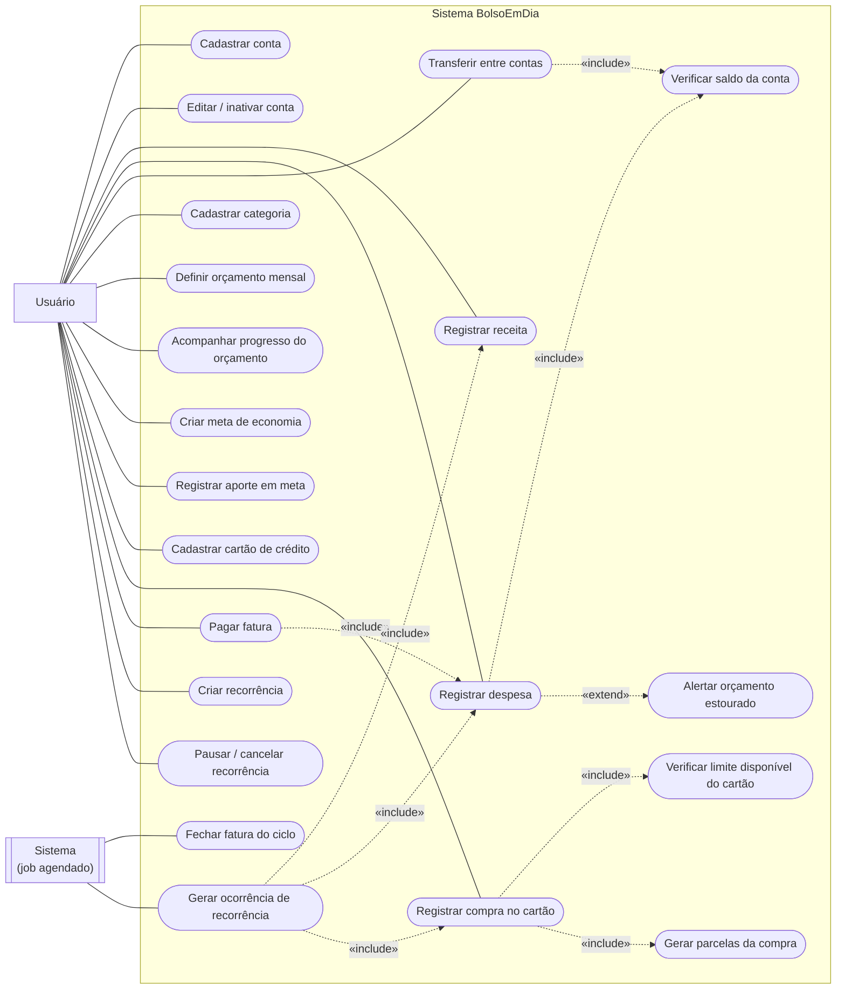

# Casos de uso

Mermaid não tem um tipo de diagrama nativo para caso de uso UML (só tem `flowchart`, `sequenceDiagram`, `classDiagram`, `erDiagram`, `stateDiagram` etc.). A convenção abaixo usa `flowchart` para chegar o mais perto possível da notação clássica: ator como retângulo fora do limite do sistema, caso de uso como nó "estádio" (oval) dentro de um `subgraph` que representa a fronteira do sistema, associação como linha simples, `<<include>>`/`<<extend>>` como seta tracejada rotulada. Renderiza igual no GitHub — não precisa de plugin UML.

Dois atores: **Usuário** (dono dos dados financeiros, interage direto) e **Sistema** (os dois processos agendados que rodam sem intervenção humana: fechar fatura no dia certo e gerar a próxima ocorrência de uma recorrência).

## Como ler as relações que não são associação direta

- **`«include»` é comportamento que sempre acontece.** "Registrar despesa" sempre inclui "Verificar saldo da conta" — não tem como registrar despesa sem passar por essa checagem, então não é opcional.
- **`«extend» é comportamento condicional, que só entra às vezes.** "Alertar orçamento estourado" estende "Registrar despesa" porque só dispara **se** a categoria tiver orçamento definido para o mês **e** o total já tiver passado da meta — na maioria dos lançamentos isso nunca aciona. É o oposto de `include`, e é justamente por isso que o alerta não pode usar o mesmo mecanismo de bloqueio que "Verificar saldo" usa (ver a nota de arquitetura no diagrama de sequência de "Registrar despesa").
- **"Registrar compra no cartão" inclui duas coisas em sequência**: primeiro "Verificar limite disponível" (que pode reprovar a compra inteira), depois — só se aprovado — "Gerar parcelas da compra". Um `include` que falha aborta o caso de uso principal; é assim que "compra bloqueada por limite insuficiente" é modelado aqui.
- **"Pagar fatura" inclui "Registrar despesa"**, não um caso de uso próprio de lançamento — pagar fatura é, sob o capô, uma despesa na conta de pagamento do cartão. Isso é intencional: evita duplicar a regra de saldo insuficiente em dois lugares.
- **"Gerar ocorrência de recorrência" inclui três casos de uso alternativos** (receita, despesa ou compra no cartão) porque uma `Recorrencia` só aciona **um** deles por execução, dependendo de como o modelo foi configurado (`IdConta` → receita ou despesa; `IdCartao` → compra). O diagrama mostra as três setas para deixar claro que são alternativas, não que as três disparam juntas — os detalhes de qual é escolhida e como estão no diagrama de sequência correspondente.
- **"Cadastrar cartão" e "Registrar compra no cartão" não incluem "Verificar saldo da conta"** de propósito — cartão não tem saldo, só limite. Se algum dia esse `include` aparecer num PR, é sinal de que a regra "cartão não afeta saldo bancário diretamente" (skill `regras-negocio-financas`) foi violada.

Para o comportamento passo a passo por trás de cada caso de uso marcado com `include`/`extend` acima, veja [`diagramas-sequencia.md`](diagramas-sequencia.md).
