# DER — Diagrama Entidade-Relacionamento (lógico)

Mesmo domínio do [MER](mer.md), agora no nível que vira tabela: tipos de dado, chave primária, chave estrangeira e chave única. Os nomes seguem a convenção já usada no projeto (`IdEntidade` int autoincremento, `IdUsuario` string vindo do Identity — ver `arquitetura-api`/`dominio.md`). Todas as entidades marcadas com "escopo por usuário" abaixo carregam `IdUsuario` e entram no filtro global `IPertenceAoUsuario`; ele foi omitido do texto descritivo para não repetir, mas está em todo diagrama.

Campos de auditoria (`DataCriacao`, `IdUsuarioCriacao`, `DataModificacao`, `IdUsuarioModificacao`) existem em todas as entidades de negócio via `IAuditoria`, mas foram omitidos do diagrama para não poluir — são metadados de infraestrutura, não modelo de domínio. Detalhes no [dicionário de dados](dicionario-dados.md).

```mermaid
erDiagram
    APPLICATION_USER ||--o{ CONTA : possui
    APPLICATION_USER ||--o{ CATEGORIA : possui
    APPLICATION_USER ||--o{ CARTAO : possui
    APPLICATION_USER ||--o{ TRANSACAO : registra
    APPLICATION_USER ||--o{ TRANSFERENCIA : registra
    APPLICATION_USER ||--o{ ORCAMENTO : define
    APPLICATION_USER ||--o{ META_ECONOMIA : define
    APPLICATION_USER ||--o{ COMPRA : registra
    APPLICATION_USER ||--o{ RECORRENCIA : define

    CONTA ||--o{ TRANSACAO : "IdConta"
    CONTA ||--o{ TRANSFERENCIA : "IdContaOrigem"
    CONTA ||--o{ TRANSFERENCIA : "IdContaDestino"
    CONTA ||--o{ CARTAO : "IdContaPagamento"
    CONTA |o--o{ META_ECONOMIA : "IdConta (nullable)"

    CATEGORIA ||--o{ TRANSACAO : "IdCategoria (nullable)"
    CATEGORIA ||--o{ ORCAMENTO : "IdCategoria"
    CATEGORIA ||--o{ COMPRA : "IdCategoria"
    CATEGORIA ||--o{ RECORRENCIA : "IdCategoria"
    CATEGORIA |o--o{ CATEGORIA : "IdCategoriaPai (nullable)"

    TRANSFERENCIA ||--|{ TRANSACAO : "IdTransferencia (nullable)"

    CARTAO ||--o{ FATURA : "IdCartao"
    CARTAO ||--o{ COMPRA : "IdCartao"

    FATURA ||--o{ PARCELA : "IdFatura"
    FATURA |o--|| TRANSACAO : "IdTransacaoPagamento (nullable)"

    COMPRA ||--|{ PARCELA : "IdCompra"

    META_ECONOMIA ||--o{ APORTE_META : "IdMeta"
    APORTE_META |o--|| TRANSACAO : "IdTransacao (nullable)"

    RECORRENCIA |o--o{ TRANSACAO : "IdRecorrencia (nullable)"
    RECORRENCIA |o--o{ COMPRA : "IdRecorrencia (nullable)"

    APPLICATION_USER {
        string Id PK "Identity, GUID string"
        string Nome
        string Email UK
        string PasswordHash
    }

    CONTA {
        int IdConta PK
        string IdUsuario FK
        string Nome
        int Tipo "enum TipoConta: Corrente=0, Poupanca=1, Carteira=2, Investimento=3"
        decimal SaldoInicial
        bool Ativa
    }

    CATEGORIA {
        int IdCategoria PK
        string IdUsuario FK
        string Nome
        int Tipo "enum TipoCategoria: Receita=0, Despesa=1"
        int IdCategoriaPai FK "nullable, self-reference"
        bool Ativa
    }

    TRANSACAO {
        int IdTransacao PK
        string IdUsuario FK
        int IdConta FK
        int IdCategoria FK "nullable — null quando Tipo e Transferencia*"
        int IdTransferencia FK "nullable"
        int IdRecorrencia FK "nullable"
        int Tipo "enum TipoTransacao: Receita=0, Despesa=1, TransferenciaSaida=2, TransferenciaEntrada=3"
        date Data
        decimal Valor "sempre positivo"
        string Descricao "nullable"
    }

    TRANSFERENCIA {
        int IdTransferencia PK
        string IdUsuario FK
        int IdContaOrigem FK
        int IdContaDestino FK
        date Data
        decimal Valor "sempre positivo"
        string Descricao "nullable"
    }

    ORCAMENTO {
        int IdOrcamento PK
        string IdUsuario FK
        int IdCategoria FK "deve ser Categoria.Tipo = Despesa"
        date MesReferencia "UK composta com IdCategoria — 1 orcamento por categoria/mes"
        decimal ValorMeta
    }

    META_ECONOMIA {
        int IdMeta PK
        string IdUsuario FK
        int IdConta FK "nullable"
        string Nome
        decimal ValorAlvo
        date DataAlvo "nullable"
        bool Concluida
    }

    APORTE_META {
        int IdAporte PK
        int IdMeta FK
        int IdTransacao FK "nullable"
        date Data
        decimal Valor
    }

    CARTAO {
        int IdCartao PK
        string IdUsuario FK
        int IdContaPagamento FK
        string Nome
        decimal LimiteTotal
        int DiaFechamento "1-31"
        int DiaVencimento "1-31"
        bool Ativo
    }

    FATURA {
        int IdFatura PK
        int IdCartao FK
        int IdTransacaoPagamento FK "nullable, setado quando Status=Paga"
        date MesReferencia "UK composta com IdCartao"
        date DataFechamento
        date DataVencimento
        decimal ValorTotal "denormalizado: soma das Parcelas"
        int Status "enum StatusFatura: Aberta=0, Fechada=1, Paga=2"
    }

    COMPRA {
        int IdCompra PK
        string IdUsuario FK
        int IdCartao FK
        int IdCategoria FK
        int IdRecorrencia FK "nullable"
        date Data
        string Descricao
        decimal ValorTotal
        int NumeroParcelas
    }

    PARCELA {
        int IdParcela PK
        int IdCompra FK
        int IdFatura FK
        int Numero "1..NumeroParcelas"
        decimal Valor
    }

    RECORRENCIA {
        int IdRecorrencia PK
        string IdUsuario FK
        int IdConta FK "nullable, exclusivo com IdCartao"
        int IdCartao FK "nullable, exclusivo com IdConta"
        int IdCategoria FK
        int TipoTransacao "enum TipoTransacao, nullable — usado so quando IdConta preenchido"
        decimal Valor
        int Frequencia "enum FrequenciaRecorrencia: Semanal=0, Mensal=1, Anual=2"
        int DiaGeracao
        date DataInicio
        date DataFim "nullable"
        bool Ativa
    }
```

## Notas de mapeamento (EF Core)

- Todo enum acima é persistido com `HasConversion<int>` — segue a convenção do projeto (comparar como enum na `Expression`, nunca com cast).
- `Transacao.IdCategoria`, `Transacao.IdTransferencia` e `Transacao.IdRecorrencia` são mutuamente informativos, não mutuamente exclusivos de verdade no schema — a regra "transferência não tem categoria" é validada na entidade (`Transacao.Criar`/`internal` a partir de `Transferencia`), não por uma constraint de banco. Documentar isso no dicionário de dados evita que alguém tente modelar como `CHECK` complexo sem necessidade.
- `Orcamento` e `Fatura` têm chave única composta (`IdCategoria`+`MesReferencia` e `IdCartao`+`MesReferencia`) — vira `HasIndex(...).IsUnique()` na configuração do EF, não uma segunda PK.
- `Fatura.ValorTotal` é denormalizado (soma de `Parcela.Valor`) por performance de listagem; toda escrita em `Parcela` (inserir parcela nova, cancelar compra) precisa recalcular e persistir esse total na mesma transação — se isso não acontecer, o valor exibido diverge do real e é exatamente o tipo de bug silencioso que o domínio não pode tolerar em dinheiro.
- `Recorrencia.IdConta` e `Recorrencia.IdCartao` são mutuamente exclusivos (uma recorrência gera transação de conta OU compra de cartão, nunca os dois) — validar na criação (`Recorrencia.Criar`), não deixar os dois nulos nem os dois preenchidos.
