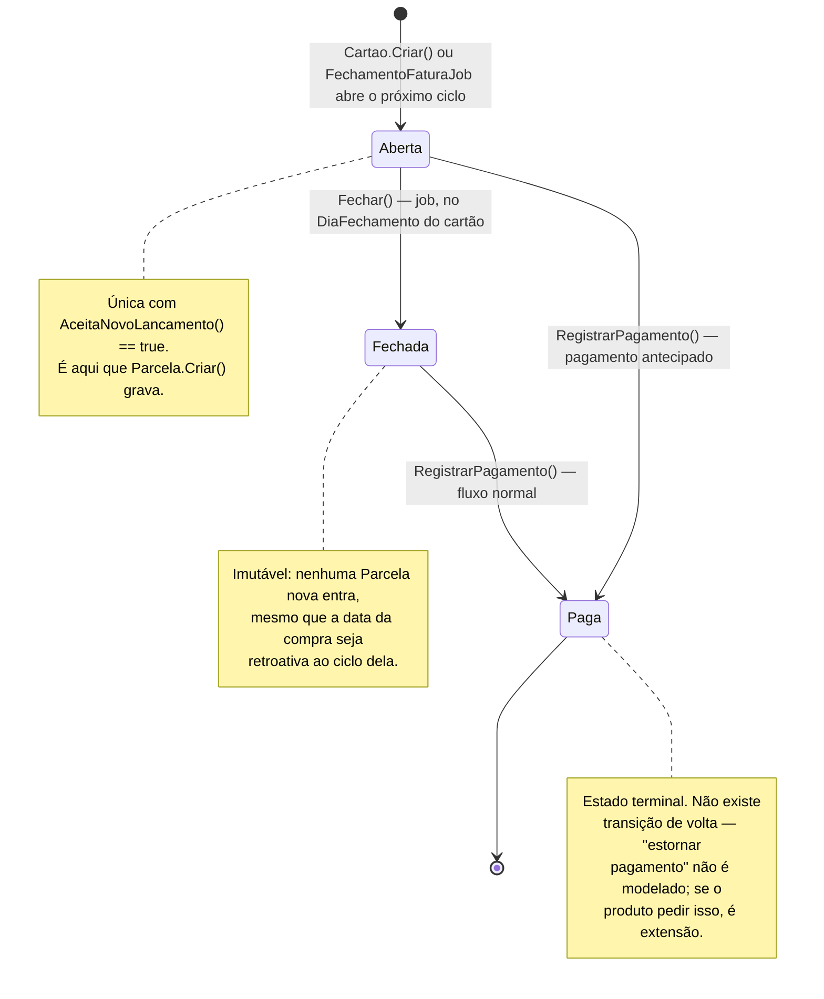
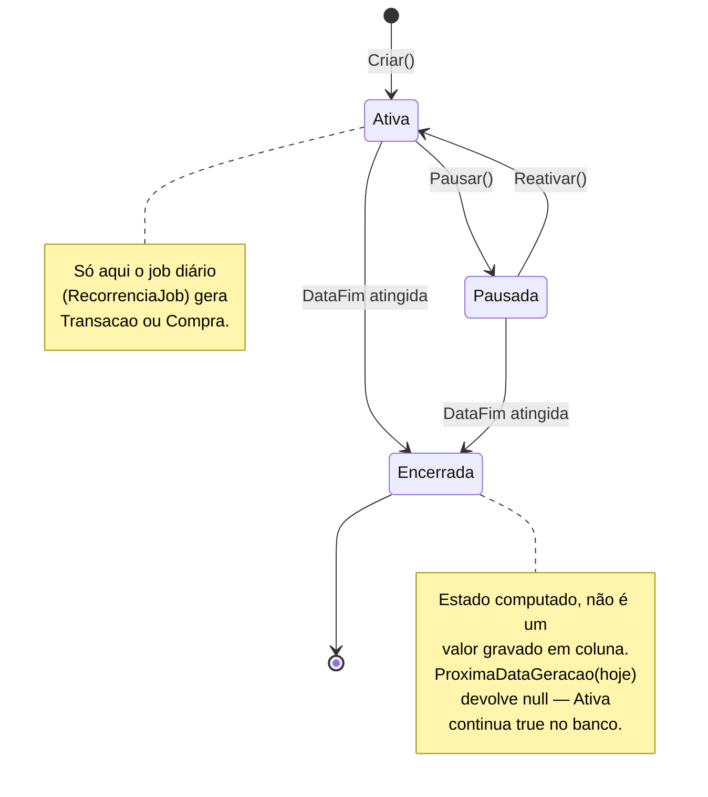

# Diagrama de estados

Os diagramas de sequência mostram uma transição de cada vez, no meio de um fluxo maior. Aqui é o oposto: a máquina de estados inteira de uma entidade, com toda transição válida (e, por omissão, toda transição que **não** existe — se não tem seta, não é permitido). As duas entidades do domínio que têm um ciclo de vida real, não só um `Ativa: bool` de liga/desliga, são `Fatura` e `Recorrencia`.

## Fatura

O que este diagrama proíbe, e por quê:

- **Não existe `Fechada → Aberta`.** Uma vez fechada, a fatura não reabre — mesmo que o usuário reclame "lancei uma compra de ontem e ela devia ter entrado nessa fatura". A resposta do sistema para esse caso é a compra cair na fatura seguinte (regra já registrada em `cartao-de-credito.md`), não reabrir a fechada.
- **`Aberta → Paga` existe** porque o diagrama de sequência 5 (pagamento) permite pagar uma fatura ainda aberta — pagamento antecipado é um caso real (usuário quita antes do vencimento). Se isso não fizer sentido pro produto, é a primeira seta a remover.
- **Não existe estado de "atrasada"/"vencida".** `DataVencimento` já vencida com `Status = Fechada` ainda não paga é uma consulta (`WHERE DataVencimento < hoje AND Status = Fechada`), não um estado próprio — não duplique isso como coluna.

## Recorrência

O ponto que vale destacar: **`Encerrada` não é um terceiro valor do campo `Ativa`** (que continua sendo `bool`). Ela é o que acontece quando `DataFim` já passou — o job simplesmente para de gerar porque `ProximaDataGeracao` não devolve mais nenhuma data, não porque alguém setou uma flag. Modelar como estado ajuda a enxergar o ciclo de vida completo, mas não vire uma coluna `Status` nova em `Recorrencia` (ver `dicionario-dados.md`) — isso duplicaria uma informação que já é derivável de `DataFim`, e dado duplicado diverge.

Repare também que `Pausada → Encerrada` existe: uma recorrência pausada não "congela" a data-fim, ela continua correndo. Se o usuário pausar em julho e a `DataFim` for agosto, ao reativar em setembro a recorrência já está `Encerrada` — o `Reativar()` nesse caso não tem efeito (ou deveria recusar, dependendo de como o produto quiser tratar; confirme antes de implementar esse detalhe, é uma zona cinzenta).
