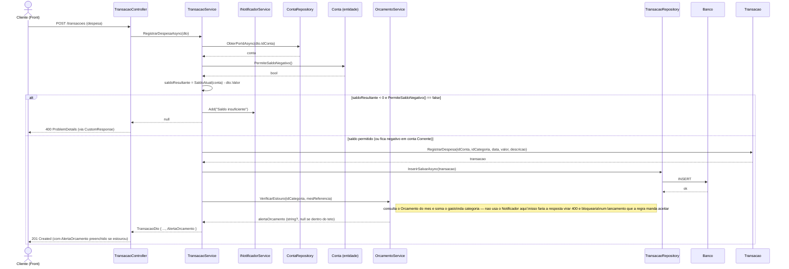
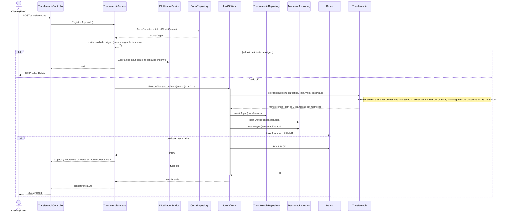
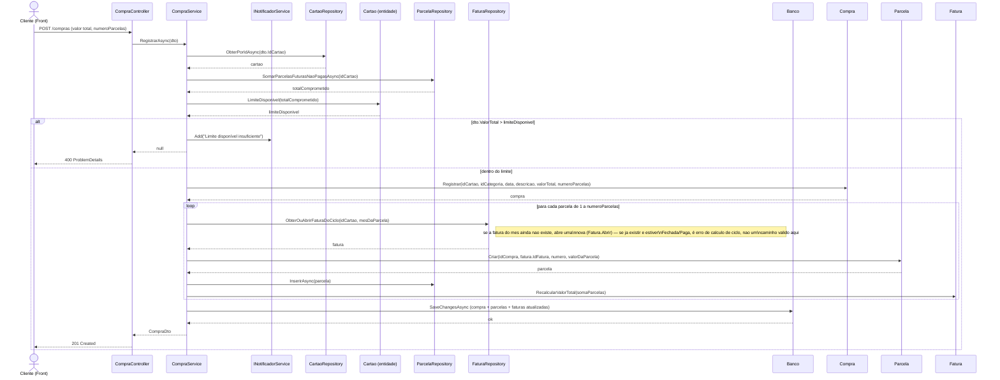
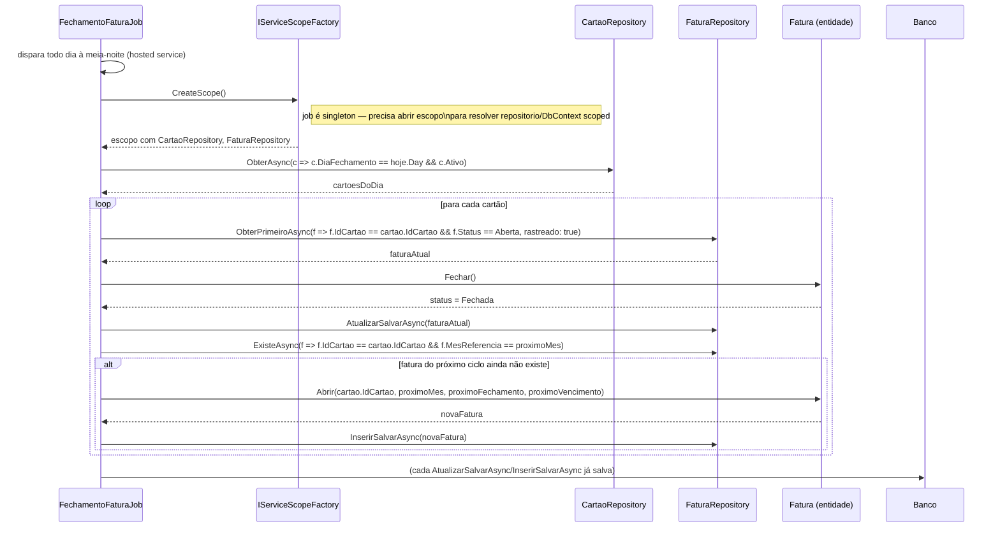
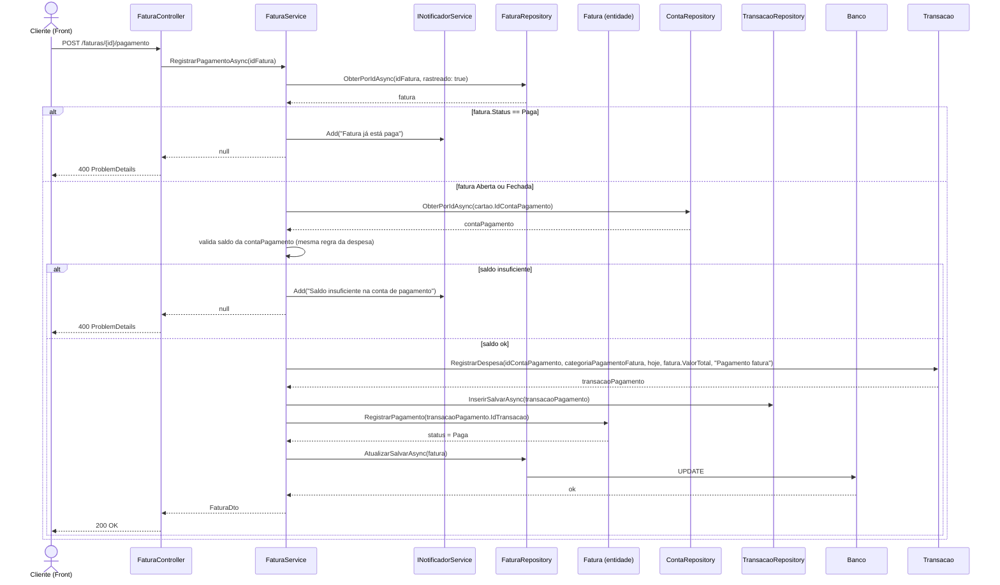
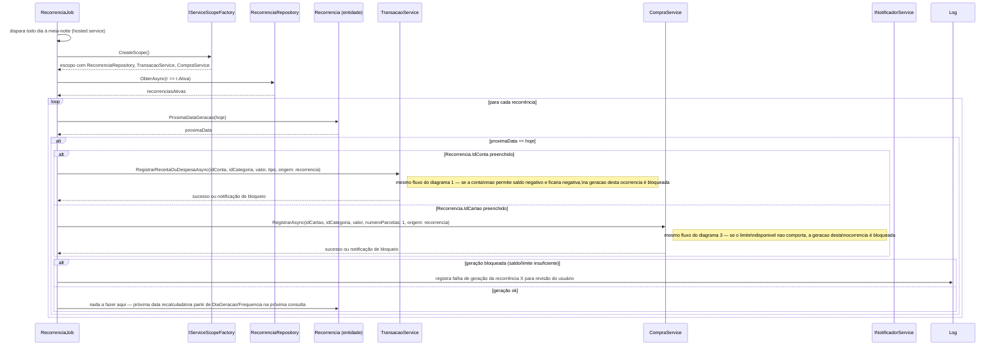

# Diagramas de sequência

Seis fluxos escolhidos porque cada um materializa um dos "invariantes críticos" da skill `regras-negocio-financas` — não é uma cobertura exaustiva de todo endpoint, é o comportamento que mais fácil de implementar errado. Os nomes de método (`InserirSalvarAsync`, `ExecuteTransactionAsync`, `_notificador.Add`, `CustomResponse`) são os reais da arquitetura já definida em `arquitetura-api` — copie o padrão, não invente um novo.

## 1. Registrar despesa — bloqueio por saldo vs. alerta de orçamento

O caso mais importante de diferenciar: **saldo insuficiente bloqueia** (quando a conta não permite negativar), **orçamento estourado só alerta**. São dois mecanismos diferentes de propósito porque um response de erro (400) não pode carregar ao mesmo tempo "sua despesa foi rejeitada" e "sua despesa foi aceita, mas passou do orçamento" — por isso o alerta de orçamento **não** passa pelo `INotificadorService` (que sempre vira erro 4xx); ele viaja como campo informativo no DTO de retorno de uma resposta 201.

## 2. Transferir entre contas — atomicidade das duas pernas

`Transferencia.Registrar` nunca é chamado fora de uma transação de banco — se a perna de entrada falhasse depois da de saída já ter sido persistida, o dinheiro "sumiria" de uma conta sem aparecer na outra. É exatamente para isso que `IUnitOfWork.ExecuteTransactionAsync` existe (ver `persistencia.md` do `arquitetura-api`): abre, roda as duas inserções sem salvar (`InserirAsync`), e só comita as duas juntas no fim.

## 3. Registrar compra parcelada no cartão — limite disponível

O ponto que mais gera bug: o limite disponível considera **todas** as parcelas futuras não pagas, não só a fatura aberta — então a validação precisa somar parcelas de várias faturas antes de decidir. Se aprovado, a compra gera N parcelas distribuídas em N faturas consecutivas (abrindo fatura nova quando ainda não existir uma para aquele mês).

## 4. Job — fechamento automático da fatura

Roda diariamente (hosted service). Para cada cartão cujo `DiaFechamento` é hoje, fecha a fatura do ciclo atual (trava novos lançamentos nela) e garante que a fatura do próximo ciclo já exista aberta, para que compras feitas amanhã tenham onde cair.

## 5. Pagar fatura — gera despesa e libera limite

Pagar a fatura não é uma entidade nova nem um valor guardado à parte: é uma despesa comum na conta de pagamento do cartão. O limite volta a ficar disponível como efeito colateral de `Status = Paga` — nenhuma parcela é apagada, só deixa de contar como "não paga" na soma que `LimiteDisponivel` usa.

## 6. Job — geração de ocorrência de recorrência

Roda diariamente. Para cada `Recorrencia` ativa cuja próxima data de geração é hoje, cria a transação (receita/despesa) ou a compra correspondente, na conta ou cartão configurado — e é exatamente o mesmo caminho de "Registrar despesa"/"Registrar compra" usado quando um humano lança manualmente, incluindo a validação de saldo/limite. Uma recorrência não tem passe livre para violar o mesmo invariante que bloquearia um lançamento manual.

