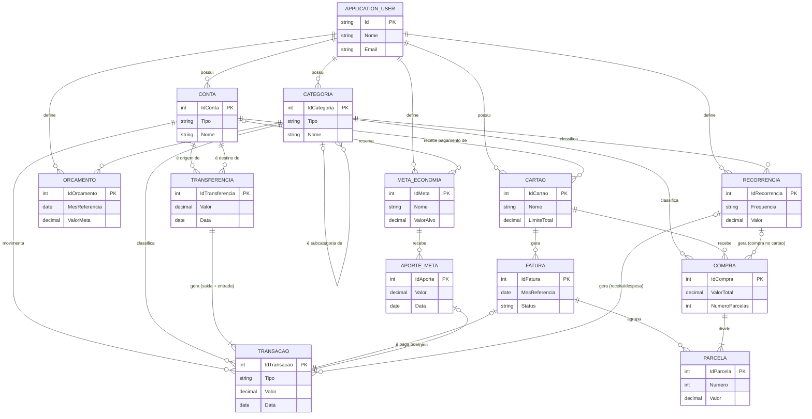

# MER — Modelo Entidade-Relacionamento (conceitual)

Visão de negócio do domínio do BolsoEmDia: só entidades, seus atributos-chave e como se relacionam. Sem tipos de dado, sem chave estrangeira explícita — isso fica no [DER](der.md). Se uma regra aqui parecer estranha, ela vem de `regras-negocio-financas` (skill do repositório) — este diagrama é a tradução visual daquelas regras, não uma fonte nova.

## Leitura rápida das relações que fogem do óbvio

- **Cartão não empresta saldo de conta** — a única ponte entre `CARTAO` e `CONTA` é "recebe pagamento de": a conta só entra quando a fatura é paga.
- **Transferência gera duas transações**, nunca uma só — por isso a cardinalidade é `||--|{` (uma transferência, uma-ou-mais... na prática sempre exatas duas) e não `||--o{`.
- **Compra e Transação não se tocam.** Uma compra no cartão nunca vira uma linha em `TRANSACAO` diretamente — ela move para `CONTA` só indiretamente, quando a `FATURA` que a contém é paga (aí sim nasce uma `TRANSACAO` de pagamento).
- **Categoria se relaciona consigo mesma** (subcategoria de) — hierarquia de um nível, ver `dicionario-dados.md` para a regra de agregação de totais.
- **Recorrência é a origem de duas coisas diferentes**: transações (receita/despesa em conta) ou compras (cartão), nunca as duas ao mesmo tempo para o mesmo registro.
