# UML — Diagrama de classes

Este diagrama já é "de código": segue a convenção de entidade do projeto (`arquitetura-api` → `dominio.md`) — `private set` em tudo, `static Criar` como único portão de entrada, um método por transição de estado, `internal static Criar` para entidade que só a raiz do agregado pode instanciar. Se você for implementar `BolsoEmDia.Domain/Entidades`, as classes abaixo são o ponto de partida; os métodos listados são os que a regra de negócio exige, não uma lista exaustiva de getters/setters (esses não existem — é tudo `private set`, leitura é por propriedade pública).

## Agregados

- **Conta** — raiz. Não contém `Transacao` como coleção interna (volume alto demais para carregar em memória); a ligação é por `IdConta`, e quem cria transação é o serviço de aplicação chamando `Transacao.RegistrarReceita/RegistrarDespesa`, não `Conta.RegistrarTransacao`. Ver nota abaixo.
- **Transferencia** — raiz. `Transacao` (as duas pernas) é criada **por dentro** dela via `internal static Transacao.CriarPernaTransferencia`, nunca por fora.
- **Cartao** — raiz. `Fatura` é interna (só o cartão abre/fecha fatura).
- **Compra** — raiz própria (não é filha de `Cartao`, porque quem valida limite disponível e gera parcelas é a compra em si, olhando faturas do cartão). `Parcela` é interna a `Compra`.
- **MetaEconomia** — raiz. `AporteMeta` é interna.
- **Categoria**, **Orcamento**, **Recorrencia** — raízes simples, sem entidade interna.

> Nota sobre `Transacao` sem ser filha de `Conta`: a regra de "ter repositório próprio não faz de uma entidade uma raiz" (ver `dominio.md`) é sobre leitura. Aqui é diferente — escrita em `Transacao` muda o saldo de `Conta`, que é um invariante do agregado `Conta`. Na prática isso significa que o **serviço de aplicação**, não a entidade, orquestra "criar transação → invariante de saldo permite?" chamando `Conta.PermiteSaldoNegativo()` antes de persistir. É uma consequência do volume (não dá para carregar todas as transações de uma conta em memória toda vez que alguém lança uma despesa) — documente essa exceção se um revisor perguntar por que `Transacao` não está dentro de `Conta`.

```mermaid
classDiagram
    class Conta {
        -int IdConta
        -string IdUsuario
        -string Nome
        -TipoConta Tipo
        -decimal SaldoInicial
        -bool Ativa
        +Criar(idUsuario, nome, tipo, saldoInicial)$ Conta
        +Renomear(nome)
        +Ativar()
        +Desativar()
        +PermiteSaldoNegativo() bool
    }

    class TipoConta {
        <<enumeration>>
        Corrente
        Poupanca
        Carteira
        Investimento
    }

    class Transacao {
        -int IdTransacao
        -string IdUsuario
        -int IdConta
        -int IdCategoria
        -int IdTransferencia
        -int IdRecorrencia
        -TipoTransacao Tipo
        -DateTime Data
        -decimal Valor
        -string Descricao
        +RegistrarReceita(idConta, idCategoria, data, valor, descricao)$ Transacao
        +RegistrarDespesa(idConta, idCategoria, data, valor, descricao)$ Transacao
        +CriarPernaTransferencia(idTransferencia, idConta, tipo, data, valor)$ Transacao
        +Editar(data, valor, categoria, descricao)
        +EstaEfetivada(dataReferencia) bool
    }

    class TipoTransacao {
        <<enumeration>>
        Receita
        Despesa
        TransferenciaSaida
        TransferenciaEntrada
    }

    class Transferencia {
        -int IdTransferencia
        -string IdUsuario
        -int IdContaOrigem
        -int IdContaDestino
        -DateTime Data
        -decimal Valor
        -string Descricao
        -List~Transacao~ Pernas
        +Registrar(idContaOrigem, idContaDestino, data, valor, descricao)$ Transferencia
        +Pernas() IReadOnlyCollection~Transacao~
    }

    class Categoria {
        -int IdCategoria
        -string IdUsuario
        -string Nome
        -TipoCategoria Tipo
        -int IdCategoriaPai
        -bool Ativa
        +Criar(idUsuario, nome, tipo, idCategoriaPai)$ Categoria
        +Renomear(nome)
        +Ativar()
        +Desativar()
    }

    class TipoCategoria {
        <<enumeration>>
        Receita
        Despesa
    }

    class Orcamento {
        -int IdOrcamento
        -string IdUsuario
        -int IdCategoria
        -DateOnly MesReferencia
        -decimal ValorMeta
        +Definir(idUsuario, idCategoria, mesReferencia, valorMeta)$ Orcamento
        +AlterarMeta(valorMeta)
        +PercentualConsumido(totalGastoNoMes) decimal
        +Estourado(totalGastoNoMes) bool
    }

    class MetaEconomia {
        -int IdMeta
        -string IdUsuario
        -int IdConta
        -string Nome
        -decimal ValorAlvo
        -DateTime DataAlvo
        -bool Concluida
        -List~AporteMeta~ Aportes
        +Criar(idUsuario, nome, valorAlvo, dataAlvo, idConta)$ MetaEconomia
        +RegistrarAporte(valor, data, idTransacao)
        +TotalAportado() decimal
        +VerificarConclusao()
    }

    class AporteMeta {
        -int IdAporte
        -int IdMeta
        -int IdTransacao
        -DateTime Data
        -decimal Valor
        +Criar(idMeta, valor, data, idTransacao)$ AporteMeta
    }

    class Cartao {
        -int IdCartao
        -string IdUsuario
        -int IdContaPagamento
        -string Nome
        -decimal LimiteTotal
        -int DiaFechamento
        -int DiaVencimento
        -bool Ativo
        -List~Fatura~ Faturas
        +Criar(idUsuario, nome, limiteTotal, diaFechamento, diaVencimento, idContaPagamento)$ Cartao
        +LimiteDisponivel(totalParcelasFuturasNaoPagas) decimal
        +FaturaAbertaPara(data) Fatura
        +Ativar()
        +Desativar()
    }

    class Fatura {
        -int IdFatura
        -int IdCartao
        -int IdTransacaoPagamento
        -DateOnly MesReferencia
        -DateTime DataFechamento
        -DateTime DataVencimento
        -decimal ValorTotal
        -StatusFatura Status
        +Abrir(idCartao, mesReferencia, dataFechamento, dataVencimento)$ Fatura
        +Fechar()
        +RegistrarPagamento(idTransacaoPagamento)
        +RecalcularValorTotal(somaParcelas)
        +AceitaNovoLancamento() bool
    }

    class StatusFatura {
        <<enumeration>>
        Aberta
        Fechada
        Paga
    }

    class Compra {
        -int IdCompra
        -string IdUsuario
        -int IdCartao
        -int IdCategoria
        -int IdRecorrencia
        -DateTime Data
        -string Descricao
        -decimal ValorTotal
        -int NumeroParcelas
        -List~Parcela~ Parcelas
        +Registrar(idCartao, idCategoria, data, descricao, valorTotal, numeroParcelas, limiteDisponivel)$ Compra
        +Cancelar()
    }

    class Parcela {
        -int IdParcela
        -int IdCompra
        -int IdFatura
        -int Numero
        -decimal Valor
        +Criar(idCompra, idFatura, numero, valor)$ Parcela
    }

    class Recorrencia {
        -int IdRecorrencia
        -string IdUsuario
        -int IdConta
        -int IdCartao
        -int IdCategoria
        -TipoTransacao TipoTransacao
        -decimal Valor
        -FrequenciaRecorrencia Frequencia
        -int DiaGeracao
        -DateTime DataInicio
        -DateTime DataFim
        -bool Ativa
        +Criar(idUsuario, idConta, idCartao, idCategoria, tipoTransacao, valor, frequencia, diaGeracao, dataInicio)$ Recorrencia
        +Pausar()
        +Reativar()
        +ProximaDataGeracao(dataReferencia) DateTime
        +GerarOcorrencia(dataReferencia)
    }

    class FrequenciaRecorrencia {
        <<enumeration>>
        Semanal
        Mensal
        Anual
    }

    class ApplicationUser {
        -string Id
        -string Nome
        -string Email
    }

    Conta ..> TipoConta
    Transacao ..> TipoTransacao
    Categoria ..> TipoCategoria
    Fatura ..> StatusFatura
    Recorrencia ..> FrequenciaRecorrencia
    Recorrencia ..> TipoTransacao

    ApplicationUser "1" --> "many" Conta : possui
    ApplicationUser "1" --> "many" Categoria : possui
    ApplicationUser "1" --> "many" Cartao : possui

    Conta "1" --> "many" Transacao : IdConta
    Conta "1" --> "many" Cartao : IdContaPagamento
    Conta "0..1" --> "many" MetaEconomia : IdConta

    Categoria "1" --> "many" Transacao : IdCategoria
    Categoria "1" --> "many" Orcamento : IdCategoria
    Categoria "1" --> "many" Compra : IdCategoria
    Categoria "0..1" --> "many" Categoria : IdCategoriaPai

    Transferencia "1" *-- "2" Transacao : Pernas

    Cartao "1" *-- "many" Fatura : Faturas
    Cartao "1" --> "many" Compra : IdCartao

    Fatura "1" *-- "many" Parcela : parcelas da fatura
    Fatura "0..1" --> "1" Transacao : IdTransacaoPagamento

    Compra "1" *-- "many" Parcela : Parcelas

    MetaEconomia "1" *-- "many" AporteMeta : Aportes
    AporteMeta "0..1" --> "1" Transacao : IdTransacao

    Recorrencia "0..1" --> "many" Transacao : gera
    Recorrencia "0..1" --> "many" Compra : gera
```

## Por que os métodos são esses

Cada método público existe porque uma regra do domínio (documentado na skill `regras-negocio-financas`) precisa de um lugar único para viver:

- `Conta.PermiteSaldoNegativo()` — em vez de espalhar `if (tipo == TipoConta.Corrente)` pelos serviços, a pergunta "essa conta pode negativar?" tem uma resposta e um lugar só.
- `Transacao.CriarPernaTransferencia` é `internal` — ninguém fora de `Transferencia.Registrar` pode criar uma transação do tipo `TransferenciaSaida`/`TransferenciaEntrada` "solta", o que garantiria a regra "transferência sempre nasce em par".
- `Cartao.LimiteDisponivel` recebe a soma das parcelas futuras não pagas como parâmetro (não recalcula sozinho) porque buscar isso é uma consulta (`Parcela` por `Fatura` não paga), responsabilidade do repositório/serviço — a entidade só aplica a fórmula.
- `Fatura.AceitaNovoLancamento()` centraliza a regra "fatura fechada é imutável" — `Compra.Registrar` consulta isso antes de decidir em qual fatura cai a parcela.
- `Orcamento.Estourado(...)` devolve `bool` mas nunca é usado para bloquear — só para acender alerta. Não existe (e não deve existir) um `Orcamento.ValidarLancamento()` que lance exceção.
