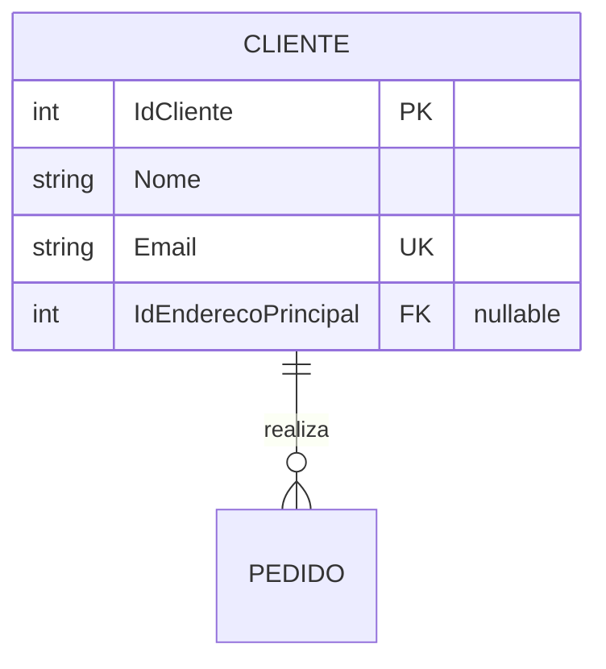
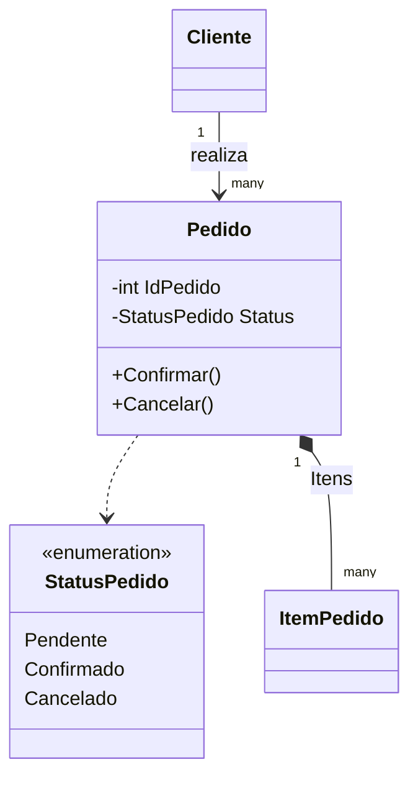
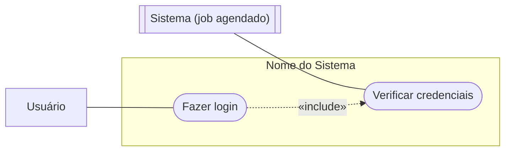
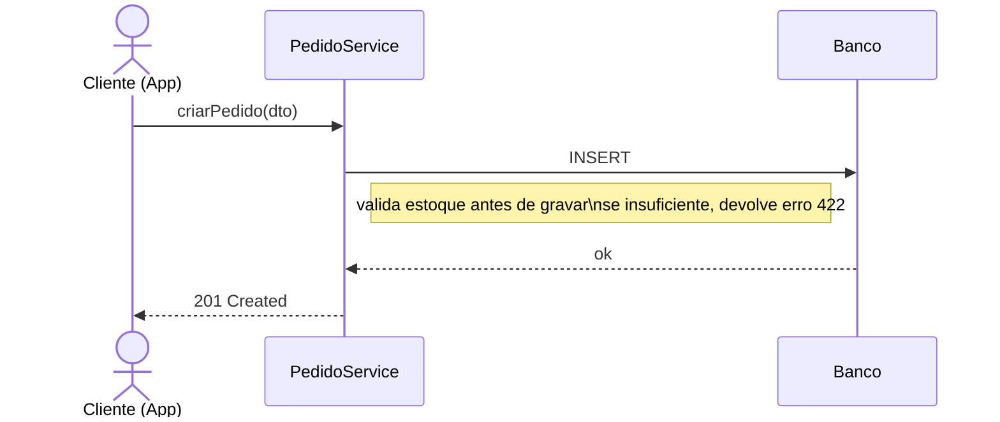
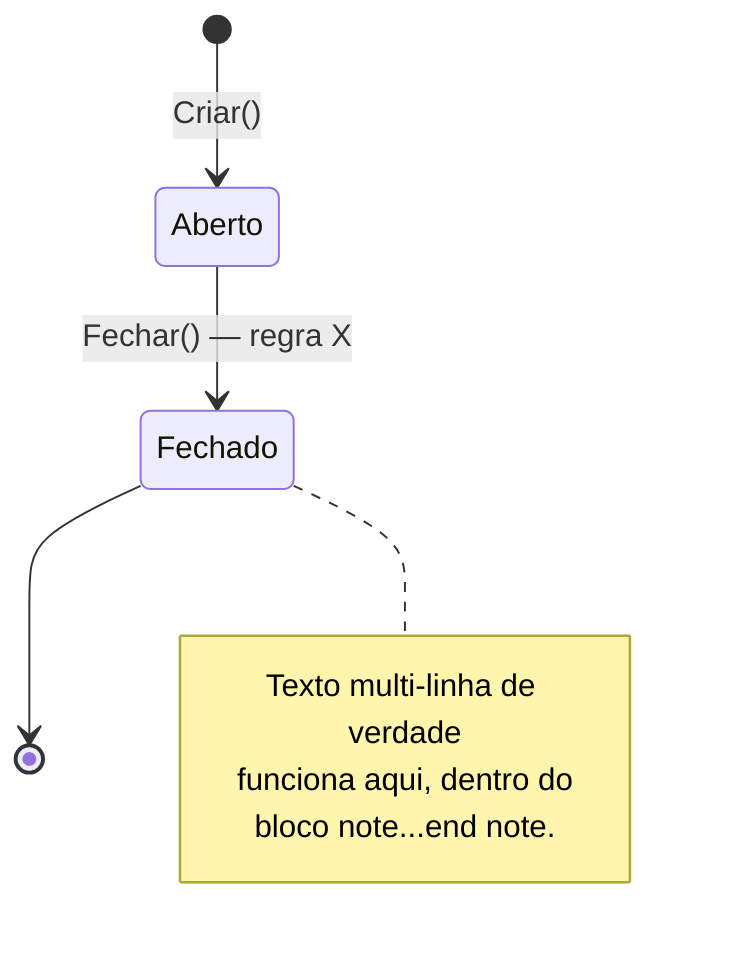

# Sintaxe Mermaid — o que quebra silenciosamente

Mermaid não tem um linter integrado no seu fluxo de trabalho normal — um erro de sintaxe não estoura exceção, o bloco só falha ao renderizar (ou renderiza errado) quando alguém abre o `.md` no GitHub. Este documento é a lista do que efetivamente causou retrabalho ao escrever os sete tipos de artefato. Releia antes do primeiro bloco de cada tipo que você ainda não escreveu nesta sessão.

Índice: [erDiagram](#erdiagram-mer--der) · [classDiagram](#classdiagram-diagrama-de-classes) · [flowchart para caso de uso](#flowchart-emulando-caso-de-uso) · [sequenceDiagram](#sequencediagram) · [stateDiagram-v2](#statediagram-v2) · [Regra geral de nomes vs. texto livre](#regra-geral-nomes-de-identificador-vs-texto-livre)

## erDiagram (MER / DER)

- **Cardinalidade**: `||` um exatamente, `o|` zero ou um, `}o` zero ou muitos, `}|` um ou muitos. Lidos de fora para dentro: `CLIENTE ||--o{ PEDIDO` = "um cliente, zero ou muitos pedidos".
- **Atributo = `tipo nome [chave] ["comentário"]`.** Tipo e nome são um token cada, sem espaço. Chave é `PK`/`FK`/`UK` (opcional). Comentário **precisa** de aspas — sem aspas, qualquer espaço ou caractere especial no comentário quebra o parser silenciosamente (o atributo some ou o bloco inteiro falha).
- **Duas relações entre o mesmo par de entidades são permitidas** — útil quando uma FK tem dois papéis (ex.: `CONTA ||--o{ TRANSFERENCIA : "é origem de"` e `CONTA ||--o{ TRANSFERENCIA : "é destino de"` na mesma tabela `TRANSFERENCIA`, uma linha por FK). Não tente forçar isso numa relação só.
- **Nome de entidade é identificador, não texto livre** — sem espaço, sem acento por segurança (use `CONTA`, não `Conta Bancária`). O texto livre com acento vai nos comentários entre aspas e nos rótulos de relacionamento, que aceitam UTF-8 sem problema.
- **MER (conceitual) vs. DER (lógico) não são dois tipos de diagrama diferentes no Mermaid** — é o mesmo `erDiagram`, a diferença é você incluir (DER) ou omitir (MER) o bloco de atributos com tipo/PK/FK. Escreva o MER com só 2-3 atributos-chave por entidade (o suficiente pra reconhecer a entidade), o DER com a lista completa.

## classDiagram (diagrama de classes)

- **Visibilidade**: `-` privado, `+` público, `#` protegido. Em linguagens com propriedade "get público, set privado" (C# `private set`, Kotlin `val` mutável só internamente), represente como `-campo` mesmo que a leitura seja pública — o diagrama está documentando invariante (quem pode *mudar* o estado), não a API de leitura.
- **Tipos de relação, e a diferença importa**: `-->` associação simples (referência por chave, não posse), `*--` composição (o todo cria/possui a parte — a parte não existe sem o todo, ex.: item de pedido dentro de pedido), `o--` agregação (posse mais fraca, a parte pode existir independente), `..>` dependência (usa o tipo, ex.: enum), `--|>` herança. Errar composição por associação (ou vice-versa) é o erro mais comum aqui — pergunte-se "se eu apagar o pai, o filho devia sumir junto?" antes de escolher.
- **Multiplicidade em string entre aspas**: `"1"`, `"0..1"`, `"many"` — não precisa ser número, `"many"` é aceito e mais legível que `"*"` em texto corrido.
- **Enum é uma `class` com `<<enumeration>>`** como primeira linha do corpo, seguida dos valores um por linha, sem `+`/`-`.

## flowchart emulando caso de uso

Mermaid **não tem** um tipo de diagrama nativo para caso de uso UML — só `flowchart`, `sequenceDiagram`, `classDiagram`, `erDiagram`, `stateDiagram`, entre outros. A convenção que chega mais perto da notação clássica:

- **Ator** = nó retângulo simples (`Nome[Texto]`) fora do `subgraph`. Se o texto do ator tem parênteses ou ` ` (quebra de linha), **coloque entre aspas** (`Nome["Texto (detalhe)"]`) — sem aspas, parênteses dentro de colchetes quebram o parser.
- **Caso de uso** = nó "estádio" `([Texto])` — a forma mais próxima da elipse UML disponível no Mermaid. Sempre dentro do `subgraph` que representa a fronteira do sistema.
- **Fronteira do sistema** = `subgraph id["Título"]` ... `end`. O `id` é o identificador (sem espaço), o título entre aspas pode ter espaço/acento.
- **Associação ator↔caso de uso** = `---` (linha sem seta, como UML pede). Não use `-->` aqui — a seta cheia fica reservada para fluxo de controle, que não é o que uma associação de caso de uso representa.
- **`«include»`/`«extend»`** = seta tracejada rotulada: `UC_A -.->|"«include»"| UC_B`. As aspas duplas em volta do rótulo são necessárias porque `«»` são caracteres especiais. `include` é comportamento que sempre acontece dentro do caso de uso base; `extend` é condicional — só dispara às vezes. Escolher errado entre os dois é o erro conceitual mais comum aqui, não um erro de sintaxe: se você tiraria a seta e o caso de uso base ainda faria sentido sozinho na maioria das execuções, é `extend`; se o caso de uso base não funciona sem ela, é `include`.

## sequenceDiagram

- **Uma `Note ... : texto` é uma única linha de statement.** Para quebrar em mais de uma linha visual dentro da nota, use o literal `\n` (barra invertida + letra n, dois caracteres) **dentro da mesma linha do arquivo** — não aperte Enter no meio do texto da nota, isso quebra o parser porque o Mermaid não sabe que a linha seguinte ainda faz parte da nota anterior.
- **`actor X as Nome de Exibição`** aceita espaço e parênteses no nome de exibição sem precisar de aspas (diferente do flowchart) — mas evite `:` dentro do nome de exibição, porque `:` é o separador de mensagem/nota em outro lugar da mesma linha de statement.
- **`alt/else/end`** para bloqueio condicional (ex.: "se saldo insuficiente... senão..."), **`loop/end`** para repetição (ex.: gerar N parcelas), **`activate`/`deactivate`** opcional para mostrar vida de uma chamada assíncrona/transação.
- **Use os nomes de método reais do projeto-alvo** nas mensagens (`->>Servico: NomeRealDoMetodo(...)`), não um nome genérico inventado — é a diferença entre esse diagrama ser um mapa confiável do código e ser uma ficção educada.

## stateDiagram-v2

- **Rótulo de transição fica melhor numa linha só.** Diferente da `Note` do `sequenceDiagram`, o `\n` literal em rótulo de transição de `stateDiagram-v2` é menos consistente entre versões do Mermaid — prefira um rótulo curto de uma linha e explique o detalhe na prosa logo abaixo do bloco.
- **`note right of Estado ... end note` aceita múltiplas linhas reais** (Enter de verdade funciona aqui, ao contrário da `Note` de uma linha do `sequenceDiagram`) — é um bloco delimitado por `end note`, não um statement de uma linha.
- **Toda transição que não está desenhada é uma proibição implícita.** Antes de considerar o diagrama pronto, releia e pergunte "existe algum jeito no código/regra de ir de A pra C sem passar por B?" — se sim e o diagrama não mostra isso, ele está incompleto, não simplificado.
- **Não crie um estado para o que é, na verdade, um campo derivado.** Se "Encerrado" é só "a data-fim já passou", isso é um estado computado (documente como tal), não motivo para adicionar uma coluna `Status` nova que pode divergir do campo de onde ele deriva.

## Regra geral: nomes de identificador vs. texto livre

Em todo tipo acima, há duas categorias de texto e confundi-las é a causa mais comum de bloco quebrado:

1. **Identificadores** (nome de entidade no `erDiagram`, nome de classe/participante, `id` de nó/`subgraph` no `flowchart`) — token único, sem espaço, sem acento por segurança, sem caractere especial. É o que o Mermaid usa internamente para achar e ligar os nós.
2. **Texto livre** (comentário de atributo, rótulo de relação, texto dentro de `[]`/`([])`/`{}`, conteúdo de `Note`) — aceita espaço, acento, UTF-8 sem problema, mas precisa estar entre aspas sempre que contiver um caractere que o Mermaid também usa como sintaxe: parênteses, `«»`, `:` no meio do texto, `|`.

Quando um bloco falha e não é óbvio por quê, a primeira pergunta é: "esse texto tem um caractere de sintaxe e eu esqueci de colocar entre aspas?"
